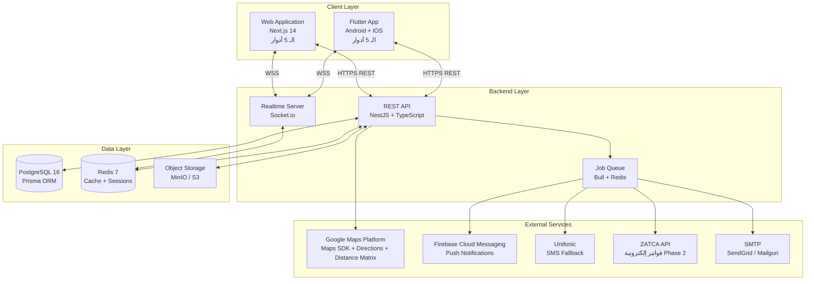
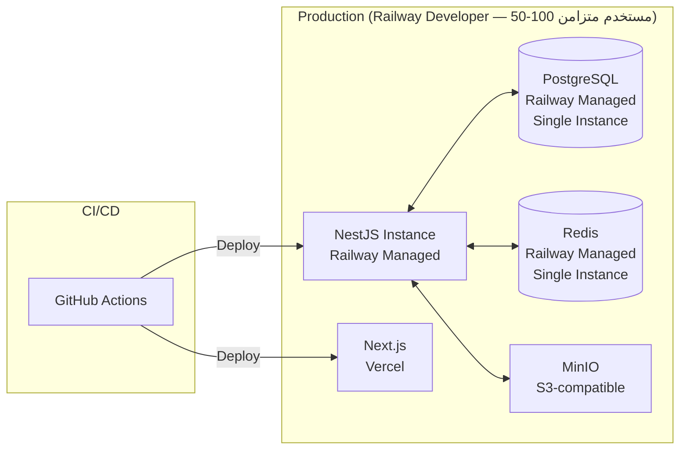

# TECH.md — إدهام للوجستيات

**الإصدار:** 1.2  
**التاريخ:** 2026-07-02  
**يعتمد على:** SPEC.md v1.0 + Client Answers (Q2, Q3, Q4, Q5, Q6, Q7, Q9, Q10, Q11, Q12) + فلو التسعير اليدوي  
**الكاتب:** Senior Software Architect  

---

## 1. نظرة معمارية (Architecture Overview)

### 1.1 High-Level Architecture



**وصف المكونات:**

| المكوّن | الدور |
|---------|-------|
| Flutter App (الـ 5 أدوار) | تطبيق Android/iOS للعميل والسائق والمشرف والمحاسب والورشة |
| Web Application (Next.js) (الـ 5 أدوار) | موقع ويب للعميل والسائق والمشرف والمحاسب والورشة |
| REST API (NestJS) | المنطق التجاري كامل، RBAC، Validation |
| Socket.io Server | تحديثات GPS الحية، إشعارات Dashboard الفورية |
| Bull Queue (Redis) | المهام الخلفية: إرسال إشعارات، ZATCA، PDF generation |
| PostgreSQL | قاعدة البيانات الرئيسية للبيانات العلائقية |
| Redis | Cache للـ JWT blacklist، sessions، rate limiting، Bull queues |
| MinIO / S3 | تخزين الصور (إثبات التسليم، التوقيعات) + PDF الفواتير |

### 1.2 Deployment Architecture



**البيئات:**

| البيئة | الـ Hosting | الغرض |
|--------|------------|-------|
| local | Docker Compose | تطوير محلي |
| dev | Railway Developer ($5/شهر) | تجارب المطورين |
| staging | Railway Developer | اختبار QA قبل الإنتاج |
| production | Railway Developer ($5/شهر) | الإنتاج — كافٍ لـ 50-100 مستخدم متزامن |

**ملاحظة (مُثبَّتة من إجابة العميل — Q5):** الحد الأقصى 50-100 مستخدم متزامن. لا حاجة لـ Load Balancer أو multi-instance أو AWS في المرحلة الحالية. PostgreSQL single instance بلا read replicas. Socket.io بلا Redis Cluster. يُعاد التقييم عند تجاوز 300 مستخدم متزامن.

---

## 2. قرارات الـ Tech Stack

| الطبقة | الاختيار | السبب (مرتبط بـ SPEC.md) | البدائل المرفوضة | المقايضات |
|--------|---------|--------------------------|-----------------|-----------|
| Mobile | **Flutter 3.x** | SPEC §1.2 يطلب Android + iOS. Flutter كودبيس واحد، Dart strict mode، أداء native. Offline-first سهل (Hive/SQLite). | React Native: مكتبات GPS أضعف. Native: ضعف تكاليف. | Dart learning curve للفريق |
| Web Dashboard | **Next.js 14 (App Router)** | واجهة ويب للـ 5 أدوار كلهم. SSR للأداء. App Router لـ Layouts منفصلة لكل دور. | Remix: مجتمع أصغر. Vue/Nuxt: Turborepo يفضل JS موحد. | App Router في flux — بعض APIs تتغير |
| Backend | **NestJS + TypeScript** | SPEC §6 يطلب RBAC صارم. NestJS Guards/Decorators تجعل RBAC declarative. TypeScript مشترك مع Next.js في Monorepo. | Express: لا structure للـ RBAC. Fastify: أقل ecosystem للـ enterprise. | Boilerplate أكثر من Express |
| ORM | **Prisma** | Type-safe schema يمنع أخطاء SQL. Migrations سهلة. يتكامل مع TypeScript في Monorepo. | TypeORM: أقل type safety. Drizzle: ناضج أقل. | Prisma Client generation وقت بناء |
| Database | **PostgreSQL 16** | SPEC §6: علاقات معقدة (Order→Trip→Location→TempLog). JSONB للبيانات الديناميكية. Row-Level Security للـ RBAC. Spatial queries مستقبلاً (PostGIS). | MySQL: أضعف في JSON/Full-text. MongoDB: لا علاقات — يعقّد ZATCA+Invoicing. | Scaling أصعب من NoSQL في horizontal |
| Cache | **Redis 7** | Bull Queue (المهام الخلفية). JWT Refresh Token blacklist. Rate limiting. Socket.io adapter لـ multi-instance. | Memcached: لا pub/sub، لا persistence. | ذاكرة أعلى من Memcached |
| Auth | **JWT + bcrypt** | SPEC §6: access token قصير + refresh token طويل. bcrypt لكلمات مرور الموظفين. OTP للعملاء عبر SMS. | Supabase Auth: vendor lock-in. Auth0: تكلفة مرتفعة للـ MVP. | JWT stateless — يحتاج Redis blacklist للإلغاء الفوري |
| Realtime | **Socket.io** | SPEC §3 (Feature 3): خريطة حية، تحديث GPS. Socket.io Redis Adapter لـ multi-instance. يعمل مع Flutter (socket_io_client) وNext.js. | Supabase Realtime: vendor lock-in. SSE: أحادي الاتجاه فقط. | أثقل من SSE لو كانت القراءة فقط |
| Maps | **Google Maps Platform** | SPEC §5.3 + A04: معيار السوق السعودي. Directions API للمسار. Distance Matrix للـ ETA. تغطية عالية للمناطق النائية. | Mapbox: أقل تغطية في السعودية. HERE: أغلى. | تكلفة API تزيد مع النمو |
| Push | **Firebase FCM** | SPEC §5.1 (Feature 5): Android + iOS. مجاني للـ MVP. flutter_messaging جاهز. | OneSignal: طبقة إضافية فوق FCM. APNs مباشر: لا Android. | Google dependency |
| SMS | **Unifonic** | SPEC §7.4 + A08: الأبرز في السعودية. يدعم الأرقام السعودية (+966). API بسيط. | Taqnyat: بديل جيد — [ASSUMPTION: Unifonic الأول لشهرته في السوق المحلي] Twilio: أغلى لـ KSA. | تكلفة لكل رسالة |
| Storage | **MinIO (self-hosted) → AWS S3** | SPEC §2.2 السائق يرفع صور + PDF فواتير. MinIO في MVP (S3-compatible API). الانتقال لـ S3 بدون تغيير كود. | Cloudinary: رسوم transformation. Firebase Storage: vendor lock-in. | MinIO يحتاج إدارة server |
| Email | **SendGrid** | إرسال فواتير PDF للعملاء (SPEC §5 Feature 7). 100 رسالة/يوم مجاناً. | Mailgun: مشابه. SES: أرخص لكن setup أعقد. | [ASSUMPTION] |
| Hosting (API) | **Railway → AWS ECS** | سرعة إطلاق MVP. Managed PostgreSQL + Redis. الانتقال لـ AWS عند النمو. | Render: أبطأ cold starts. Fly.io: PostgreSQL أقل نضجاً managed. | Railway غير متاح في السعودية — Latency يُعوّض بـ CDN |
| Hosting (Web) | **Vercel** | Next.js first-class. Edge Functions لـ RTL detection. Preview Deployments. | Netlify: أقل تكاملاً مع Next.js App Router. | Vercel enterprise pricing لو كثر الـ traffic |
| Monorepo | **Turborepo** | كود TypeScript مشترك (shared-types). Pipeline caching. يعمل مع pnpm. | Nx: أثقل للـ setup الأولي. | Learning curve بسيط |
| Containerization | **Docker + Docker Compose** | بيئة local موحدة. الانتقال لـ ECS سهل. | — | — |

---

## 3. هيكل المشروع (Monorepo)

```
edham-logistics/
├── apps/
│   ├── mobile/   # Flutter App — الـ 5 أدوار (Android + iOS)
│   │   ├── lib/
│   │   │   ├── features/
│   │   │   │   ├── auth/           # Login + role routing
│   │   │   │   ├── customer/       # شاشات العميل
│   │   │   │   ├── driver/         # شاشات السائق
│   │   │   │   ├── supervisor/     # شاشات المشرف
│   │   │   │   ├── accountant/     # شاشات المحاسب
│   │   │   │   └── workshop/       # شاشات الورشة
│   │   │   └── main.dart
│   │   └── pubspec.yaml
│   ├── web/      # Next.js 14 — الـ 5 أدوار
│   │   ├── app/
│   │   │   ├── (auth)/             # Login page
│   │   │   ├── customer/           # Customer pages
│   │   │   ├── driver/             # Driver pages
│   │   │   ├── supervisor/         # Supervisor pages
│   │   │   ├── accountant/         # Accountant pages
│   │   │   └── workshop/           # Workshop pages
│   │   └── package.json
│   └── api/                       # NestJS Backend
│       ├── src/
│       │   ├── modules/
│       │   ├── common/
│       │   └── main.ts
│       ├── prisma/
│       │   ├── schema.prisma
│       │   └── migrations/
│       └── package.json
├── packages/
│   ├── shared-types/              # TypeScript types مشتركة (API contracts)
│   │   ├── src/
│   │   │   ├── entities.ts
│   │   │   ├── dtos.ts
│   │   │   └── enums.ts
│   │   └── package.json
│   ├── eslint-config/             # ESLint config مشترك
│   └── tsconfig/                  # Base tsconfig
├── docs/
│   ├── planning/
│   │   ├── SPEC.md
│   │   └── OPEN_QUESTIONS.md
│   └── technical/
│       └── TECH.md
├── .github/
│   └── workflows/
│       ├── ci.yml
│       ├── deploy-api.yml
│       └── deploy-web.yml
├── docker-compose.yml             # Local dev: postgres + redis + minio
├── turbo.json
├── pnpm-workspace.yaml
└── package.json
```

---

## 4. قاعدة البيانات (Database Schema)

### 4.1 ERD

```mermaid
erDiagram
    users {
        uuid id PK
        varchar full_name
        varchar phone
        varchar email
        user_role role
        user_status status
        varchar password_hash
        varchar otp_code
        timestamptz otp_expires_at
        timestamptz last_login_at
        timestamptz created_at
        timestamptz updated_at
        timestamptz deleted_at
    }

    customers {
        uuid id PK
        uuid user_id FK
        varchar company_name
        varchar tax_number
        text billing_address
        varchar payment_terms
        decimal credit_limit
        timestamptz created_at
        timestamptz updated_at
    }

    drivers {
        uuid id PK
        uuid user_id FK
        varchar employee_id
        varchar license_number
        date license_expiry
        uuid assigned_vehicle_id FK
        driver_status status
        timestamptz created_at
        timestamptz updated_at
    }

    vehicles {
        uuid id PK
        varchar plate_number
        vehicle_type type
        varchar make
        varchar model
        smallint year
        decimal capacity_kg
        boolean has_refrigeration
        vehicle_status status
        uuid current_driver_id FK
        date last_maintenance_date
        date next_maintenance_date
        timestamptz created_at
        timestamptz updated_at
        timestamptz deleted_at
    }

    orders {
        uuid id PK
        uuid customer_id FK
        text pickup_address
        decimal pickup_lat
        decimal pickup_lng
        text delivery_address
        decimal delivery_lat
        decimal delivery_lng
        cargo_type cargo_type
        decimal cargo_weight_kg
        vehicle_type vehicle_type_required
        boolean cold_chain_required
        decimal temp_min_celsius
        decimal temp_max_celsius
        decimal quoted_price
        text pricing_notes
        timestamptz pricing_sent_at
        varchar currency
        order_status status
        timestamptz scheduled_at
        timestamptz created_at
        timestamptz updated_at
        timestamptz deleted_at
    }

    trips {
        uuid id PK
        uuid order_id FK
        uuid driver_id FK
        uuid vehicle_id FK
        trip_status status
        integer total_stops
        decimal distance_km
        decimal actual_distance_km
        timestamptz actual_start_at
        timestamptz actual_end_at
        jsonb proof_photos
        text recipient_name
        text recipient_signature_url
        timestamptz created_at
        timestamptz updated_at
    }

    trip_stops {
        uuid id PK
        uuid trip_id FK
        integer sequence_number
        text address
        varchar city
        decimal latitude
        decimal longitude
        varchar contact_name
        varchar contact_phone
        timestamptz scheduled_arrival
        timestamptz actual_arrival
        trip_stop_status status
        text pod_photo_url
        text pod_signature_url
        text notes
        timestamptz created_at
    }

    locations {
        uuid id PK
        uuid vehicle_id FK
        uuid trip_id FK
        decimal lat
        decimal lng
        decimal accuracy_meters
        decimal speed_kmh
        decimal bearing_degrees
        boolean is_offline_synced
        timestamptz recorded_at
        timestamptz synced_at
    }

    temperature_logs {
        uuid id PK
        uuid trip_id FK
        uuid driver_id FK
        decimal temperature_celsius
        boolean is_violation
        text notes
        boolean is_offline_synced
        timestamptz recorded_at
        timestamptz synced_at
    }

    invoices {
        uuid id PK
        uuid order_id FK
        uuid customer_id FK
        varchar invoice_number
        decimal subtotal
        decimal vat_rate
        decimal vat_amount
        decimal total_amount
        varchar currency
        invoice_status status
        text zatca_uuid
        text zatca_hash
        text pdf_url
        timestamptz issued_at
        timestamptz due_at
        timestamptz paid_at
        timestamptz created_at
        timestamptz updated_at
    }

    maintenance_requests {
        uuid id PK
        uuid vehicle_id FK
        maintenance_type type
        text description
        uuid reported_by FK
        uuid assigned_to FK
        decimal cost
        maintenance_status status
        timestamptz scheduled_at
        timestamptz completed_at
        text notes
        timestamptz created_at
        timestamptz updated_at
    }

    notifications {
        uuid id PK
        uuid user_id FK
        notification_type type
        varchar title
        text body
        boolean is_read
        varchar reference_type
        uuid reference_id
        timestamptz created_at
    }

    audit_logs {
        uuid id PK
        uuid user_id FK
        varchar action
        varchar entity_type
        uuid entity_id
        jsonb old_values
        jsonb new_values
        varchar ip_address
        timestamptz timestamp
    }

    users ||--o| customers : "has profile"
    users ||--o| drivers : "has profile"
    customers ||--o{ orders : "places"
    drivers ||--o{ trips : "executes"
    vehicles ||--o{ trips : "used in"
    vehicles ||--o| drivers : "assigned to"
    orders ||--o| trips : "executed as"
    trips ||--o{ trip_stops : "has stops"
    trips ||--o{ locations : "records"
    trips ||--o{ temperature_logs : "logs"
    orders ||--o| invoices : "billed as"
    vehicles ||--o{ maintenance_requests : "requires"
    users ||--o{ notifications : "receives"
    users ||--o{ audit_logs : "generates"
    customers ||--o{ client_pricing_overrides : "has pricing"
```



### 4.2 الجداول التفصيلية

#### جدول: `users`
| العمود | النوع | القيود | ملاحظات |
|--------|-------|--------|---------|
| id | UUID | PK, DEFAULT gen_random_uuid() | معرّف فريد |
| full_name | VARCHAR(100) | NOT NULL | الاسم الكامل بالعربي |
| phone | VARCHAR(15) | UNIQUE, NOT NULL | صيغة: +966XXXXXXXXX |
| email | VARCHAR(255) | UNIQUE, NULLABLE | إلزامي للموظفين، اختياري للعملاء |
| role | ENUM('CUSTOMER','DRIVER','SUPERVISOR','ACCOUNTANT','WORKSHOP') | NOT NULL | SPEC §2 — 5 أدوار. SUPERVISOR يملك صلاحيات إدارة المستخدمين والتعريفة الأساسية |
| status | ENUM('ACTIVE','INACTIVE','SUSPENDED') | NOT NULL, DEFAULT 'ACTIVE' | |
| password_hash | VARCHAR(255) | NULLABLE | NULL للعملاء (OTP فقط) |
| otp_code | VARCHAR(6) | NULLABLE | مؤقت — يُمحى بعد التحقق |
| otp_expires_at | TIMESTAMPTZ | NULLABLE | صلاحية OTP: 10 دقائق [ASSUMPTION] |
| last_login_at | TIMESTAMPTZ | NULLABLE | |
| created_at | TIMESTAMPTZ | NOT NULL, DEFAULT now() | |
| updated_at | TIMESTAMPTZ | NOT NULL, DEFAULT now() | |
| deleted_at | TIMESTAMPTZ | NULLABLE | Soft Delete |

**Indexes:**
- `idx_users_phone` ON phone (UNIQUE)
- `idx_users_email` ON email (UNIQUE, NULLS NOT DISTINCT)
- `idx_users_role` ON role
- `idx_users_deleted_at` ON deleted_at WHERE deleted_at IS NULL (Partial Index)

---

#### جدول: `customers`
| العمود | النوع | القيود | ملاحظات |
|--------|-------|--------|---------|
| id | UUID | PK, DEFAULT gen_random_uuid() | |
| user_id | UUID | FK→users.id, UNIQUE, NOT NULL | علاقة 1-to-1 |
| company_name | VARCHAR(255) | NOT NULL | اسم الشركة — B2B فقط، لا أفراد (Q7) |
| commercial_registration_number | VARCHAR(50) | UNIQUE, NULLABLE | رقم السجل التجاري السعودي |
| vat_number | VARCHAR(20) | NULLABLE | الرقم الضريبي لـ ZATCA — 15 رقم |
| contact_person_name | VARCHAR(255) | NULLABLE | اسم شخص التواصل في الشركة |
| billing_address | TEXT | NULLABLE | عنوان الفاتورة |
| payment_terms_days | INTEGER | NOT NULL, DEFAULT 30 | أيام الدفع — متغير لكل عميل (Q12): 30/60/90 يوم |
| credit_limit | DECIMAL(12,2) | NULLABLE | لو عميل بحساب آجل [ASSUMPTION] |
| created_at | TIMESTAMPTZ | NOT NULL, DEFAULT now() | |
| updated_at | TIMESTAMPTZ | NOT NULL, DEFAULT now() | |

**ملاحظة B2B (Q7):** النظام للشركات فقط. لا يوجد حسابات أفراد. company_name إلزامي دائماً. كل فاتورة = فاتورة ضريبية B2B (ZATCA).

**Indexes:**
- `idx_customers_user_id` ON user_id
- `idx_customers_vat_number` ON vat_number
- `idx_customers_crn` ON commercial_registration_number (UNIQUE)

---

#### جدول: `drivers`
| العمود | النوع | القيود | ملاحظات |
|--------|-------|--------|---------|
| id | UUID | PK, DEFAULT gen_random_uuid() | |
| user_id | UUID | FK→users.id, UNIQUE, NOT NULL | علاقة 1-to-1 |
| employee_id | VARCHAR(20) | UNIQUE, NOT NULL | رقم الموظف — يُستخدم للدخول |
| license_number | VARCHAR(20) | UNIQUE, NOT NULL | رقم رخصة القيادة |
| license_expiry | DATE | NOT NULL | تنبيه عند الاقتراب (30 يوم) [ASSUMPTION] |
| assigned_vehicle_id | UUID | FK→vehicles.id, NULLABLE | المركبة الافتراضية |
| status | ENUM('AVAILABLE','ON_TRIP','OFF_DUTY','SUSPENDED') | NOT NULL, DEFAULT 'AVAILABLE' | |
| created_at | TIMESTAMPTZ | NOT NULL, DEFAULT now() | |
| updated_at | TIMESTAMPTZ | NOT NULL, DEFAULT now() | |

**Indexes:**
- `idx_drivers_employee_id` ON employee_id (UNIQUE)
- `idx_drivers_status` ON status
- `idx_drivers_license_expiry` ON license_expiry

---

#### جدول: `vehicles`
| العمود | النوع | القيود | ملاحظات |
|--------|-------|--------|---------|
| id | UUID | PK, DEFAULT gen_random_uuid() | |
| plate_number | VARCHAR(20) | UNIQUE, NOT NULL | رقم اللوحة السعودية — المعرّف الرئيسي للمركبة (Q6). صيغة: 3 أحرف عربية + 4 أرقام. Validation regex: `/^[؀-ۿ]{1,3}\s?\d{4}$/` |
| type | ENUM('HIACE_VAN','ISUZU_REFRIGERATED','VOLVO_FH_HEAVY') | NOT NULL | SPEC §5.1 |
| make | VARCHAR(50) | NOT NULL | Toyota / Isuzu / Volvo |
| model | VARCHAR(50) | NOT NULL | |
| year | SMALLINT | NOT NULL | |
| capacity_kg | DECIMAL(8,2) | NOT NULL | HiAce: 1500 / Isuzu: 5000 / Volvo: 25000 |
| temperature_capability | ENUM('REFRIGERATED','FROZEN','BOTH') | NOT NULL | نوع التبريد المتاح في المركبة (Q9). يجب أن يتوافق مع temperature_type في الطلب |
| status | ENUM('AVAILABLE','ON_TRIP','IN_MAINTENANCE','OUT_OF_SERVICE') | NOT NULL, DEFAULT 'AVAILABLE' | |
| current_driver_id | UUID | FK→users.id, NULLABLE | السائق الحالي |
| last_maintenance_date | DATE | NULLABLE | |
| next_maintenance_date | DATE | NULLABLE | تنبيه قبل 7 أيام (SPEC §4 Feature 2) |
| registration_expiry | DATE | NULLABLE | انتهاء تسجيل المركبة [ASSUMPTION] |
| created_at | TIMESTAMPTZ | NOT NULL, DEFAULT now() | |
| updated_at | TIMESTAMPTZ | NOT NULL, DEFAULT now() | |
| deleted_at | TIMESTAMPTZ | NULLABLE | Soft Delete |

**Indexes:**
- `idx_vehicles_plate` ON plate_number (UNIQUE)
- `idx_vehicles_status` ON status
- `idx_vehicles_type` ON type
- `idx_vehicles_temperature_capability` ON temperature_capability
- `idx_vehicles_next_maintenance` ON next_maintenance_date WHERE deleted_at IS NULL

**قاعدة عمل (Q9):** عند إسناد رحلة cold chain، يتحقق النظام: لو order.temperature_type = 'FROZEN' → vehicle.temperature_capability يجب أن يكون 'FROZEN' أو 'BOTH'. لو 'REFRIGERATED' → 'REFRIGERATED' أو 'BOTH'.

---

#### جدول: `orders`
| العمود | النوع | القيود | ملاحظات |
|--------|-------|--------|---------|
| id | UUID | PK, DEFAULT gen_random_uuid() | |
| customer_id | UUID | FK→customers.id, NOT NULL | |
| pickup_address | TEXT | NOT NULL | |
| pickup_lat | DECIMAL(10,7) | NOT NULL | |
| pickup_lng | DECIMAL(10,7) | NOT NULL | |
| delivery_address | TEXT | NOT NULL | |
| delivery_lat | DECIMAL(10,7) | NOT NULL | |
| delivery_lng | DECIMAL(10,7) | NOT NULL | |
| cargo_type | ENUM('DRY','CHILLED','FROZEN','HAZARDOUS') | NOT NULL | SPEC §5.2 |
| cargo_weight_kg | DECIMAL(8,2) | NOT NULL | |
| cargo_description | TEXT | NULLABLE | |
| vehicle_type_required | ENUM('HIACE_VAN','ISUZU_REFRIGERATED','VOLVO_FH_HEAVY') | NOT NULL | |
| cold_chain_required | BOOLEAN | NOT NULL, DEFAULT false | |
| temperature_type | ENUM('REFRIGERATED','FROZEN') | NULLABLE | مطلوب لو cold_chain_required = true (Q9) — يجب مطابقته مع temperature_capability للمركبة |
| temp_min_celsius | DECIMAL(5,2) | NULLABLE | مطلوب لو cold_chain_required = true |
| temp_max_celsius | DECIMAL(5,2) | NULLABLE | مطلوب لو cold_chain_required = true |
| quoted_price | DECIMAL(10,2) | NULLABLE | السعر الذي حدده المشرف (قبل الضريبة) — يُرسَل للعميل للموافقة |
| pricing_notes | TEXT | NULLABLE | ملاحظات المشرف للعميل عند تحديد السعر |
| pricing_sent_at | TIMESTAMPTZ | NULLABLE | وقت إرسال السعر للعميل بالإيميل |
| currency | CHAR(3) | NOT NULL, DEFAULT 'SAR' | SPEC §4 Feature 1 |
| status | ENUM('DRAFT','PENDING_PRICING','PRICED','CUSTOMER_CONFIRMED','ASSIGNED','LOADING','IN_TRANSIT','DELIVERED','COMPLETED','CANCELLED') | NOT NULL, DEFAULT 'DRAFT' | SPEC §4 Feature 1 |
| cancellation_reason | TEXT | NULLABLE | |
| scheduled_at | TIMESTAMPTZ | NOT NULL | |
| created_at | TIMESTAMPTZ | NOT NULL, DEFAULT now() | |
| updated_at | TIMESTAMPTZ | NOT NULL, DEFAULT now() | |
| deleted_at | TIMESTAMPTZ | NULLABLE | Soft Delete |

**Indexes:**
- `idx_orders_customer_id` ON customer_id
- `idx_orders_status` ON status
- `idx_orders_scheduled_at` ON scheduled_at
- `idx_orders_created_at` ON created_at DESC
- `idx_orders_status_created` ON (status, created_at DESC)

---

#### جدول: `trips`
| العمود | النوع | القيود | ملاحظات |
|--------|-------|--------|---------|
| id | UUID | PK, DEFAULT gen_random_uuid() | |
| order_id | UUID | FK→orders.id, UNIQUE, NOT NULL | طلب واحد = رحلة واحدة في MVP |
| driver_id | UUID | FK→drivers.id, NOT NULL | |
| vehicle_id | UUID | FK→vehicles.id, NOT NULL | |
| status | ENUM('ASSIGNED','IN_PROGRESS','AT_STOP','COMPLETED','CANCELLED') | NOT NULL | السائق لا يملك رفض الإسناد — التعيين مباشر (Q10). الرحلة تبدأ بـ ASSIGNED فور إسناد المشرف |
| estimated_distance_km | DECIMAL(8,2) | NULLABLE | |
| actual_distance_km | DECIMAL(8,2) | NULLABLE | تُحسب من مسار GPS |
| actual_start_at | TIMESTAMPTZ | NULLABLE | عند بدء السائق الرحلة فعلياً (status → IN_PROGRESS) |
| loading_start_at | TIMESTAMPTZ | NULLABLE | |
| in_transit_at | TIMESTAMPTZ | NULLABLE | |
| delivered_at | TIMESTAMPTZ | NULLABLE | |
| actual_end_at | TIMESTAMPTZ | NULLABLE | |
| proof_photos | JSONB | NULLABLE | مصفوفة URLs: [{type, url, uploaded_at}] |
| recipient_name | VARCHAR(100) | NULLABLE | اسم المستلم |
| recipient_signature_url | TEXT | NULLABLE | رابط الصورة في MinIO |
| total_stops | INTEGER | NOT NULL, DEFAULT 1 | عدد نقاط التوقف في الرحلة — Multi-stop (Q11). الرحلة مكتملة فقط لما كل stops بحالة DELIVERED |
| notes | TEXT | NULLABLE | |
| created_at | TIMESTAMPTZ | NOT NULL, DEFAULT now() | |
| updated_at | TIMESTAMPTZ | NOT NULL, DEFAULT now() | |

**Indexes:**
- `idx_trips_order_id` ON order_id
- `idx_trips_driver_id` ON driver_id
- `idx_trips_vehicle_id` ON vehicle_id
- `idx_trips_status` ON status

---

#### جدول: `trip_stops`

> **جديد — Multi-stop shipments (Q11)**

| العمود | النوع | القيود | ملاحظات |
|--------|-------|--------|---------|
| id | UUID | PK, DEFAULT gen_random_uuid() | |
| trip_id | UUID | FK→trips.id, NOT NULL | |
| sequence_number | INTEGER | NOT NULL | ترتيب التوقف: 1، 2، 3... |
| address | TEXT | NOT NULL | العنوان كاملاً |
| city | VARCHAR(100) | NULLABLE | |
| latitude | DECIMAL(10,8) | NULLABLE | |
| longitude | DECIMAL(11,8) | NULLABLE | |
| contact_name | VARCHAR(255) | NULLABLE | اسم المستلم في هذه النقطة |
| contact_phone | VARCHAR(20) | NULLABLE | |
| scheduled_arrival | TIMESTAMPTZ | NULLABLE | وقت الوصول المخطط |
| actual_arrival | TIMESTAMPTZ | NULLABLE | وقت الوصول الفعلي |
| status | ENUM('PENDING','ARRIVED','DELIVERED') | NOT NULL, DEFAULT 'PENDING' | |
| pod_photo_url | TEXT | NULLABLE | صورة إثبات التسليم في هذه النقطة |
| pod_signature_url | TEXT | NULLABLE | توقيع المستلم |
| notes | TEXT | NULLABLE | |
| created_at | TIMESTAMPTZ | NOT NULL, DEFAULT now() | |

**Indexes:**
- `idx_trip_stops_trip_id` ON trip_id
- `idx_trip_stops_status` ON (trip_id, status)
- UNIQUE (trip_id, sequence_number)

**قاعدة عمل:** الرحلة تنتقل لـ COMPLETED فقط عندما كل نقاط التوقف status = 'DELIVERED'. Google Maps Directions API يستخدم waypoints array للمسار متعدد النقاط.

---

#### جدول: `locations`
| العمود | النوع | القيود | ملاحظات |
|--------|-------|--------|---------|
| id | UUID | PK, DEFAULT gen_random_uuid() | |
| vehicle_id | UUID | FK→vehicles.id, NOT NULL | |
| trip_id | UUID | FK→trips.id, NULLABLE | NULL لو السائق متصل ولا يوجد رحلة |
| lat | DECIMAL(10,7) | NOT NULL | |
| lng | DECIMAL(10,7) | NOT NULL | |
| accuracy_meters | DECIMAL(6,2) | NULLABLE | |
| speed_kmh | DECIMAL(5,2) | NULLABLE | |
| bearing_degrees | DECIMAL(5,2) | NULLABLE | اتجاه الحركة |
| is_offline_synced | BOOLEAN | NOT NULL, DEFAULT false | SPEC §5.4 |
| recorded_at | TIMESTAMPTZ | NOT NULL | وقت التسجيل الفعلي على الجهاز |
| synced_at | TIMESTAMPTZ | NULLABLE | وقت الوصول للسيرفر |

**Indexes:**
- `idx_locations_vehicle_id_recorded` ON (vehicle_id, recorded_at DESC)
- `idx_locations_trip_id` ON trip_id
- `idx_locations_recorded_at` ON recorded_at DESC

**ملاحظة حرجة:** هذا الجدول ينمو بسرعة. [ASSUMPTION: بيانات GPS تُحذف بعد 90 يوماً (SPEC A17) عبر pg_partitioning شهري + Cron Job يمسح partitions القديمة]

---

#### جدول: `temperature_logs`
| العمود | النوع | القيود | ملاحظات |
|--------|-------|--------|---------|
| id | UUID | PK, DEFAULT gen_random_uuid() | |
| trip_id | UUID | FK→trips.id, NOT NULL | |
| driver_id | UUID | FK→drivers.id, NOT NULL | من سجّل القراءة |
| temperature_celsius | DECIMAL(5,2) | NOT NULL | |
| is_violation | BOOLEAN | NOT NULL, DEFAULT false | يُحسب تلقائياً عند الإدخال |
| notes | TEXT | NULLABLE | ملاحظات السائق عند الانتهاك |
| is_offline_synced | BOOLEAN | NOT NULL, DEFAULT false | SPEC §5.4 |
| recorded_at | TIMESTAMPTZ | NOT NULL | وقت القراءة الفعلي |
| synced_at | TIMESTAMPTZ | NULLABLE | |

**Indexes:**
- `idx_temp_logs_trip_id` ON trip_id
- `idx_temp_logs_violation` ON (trip_id, is_violation) WHERE is_violation = true
- `idx_temp_logs_recorded_at` ON recorded_at DESC

---

#### جدول: `invoices`
| العمود | النوع | القيود | ملاحظات |
|--------|-------|--------|---------|
| id | UUID | PK, DEFAULT gen_random_uuid() | |
| order_id | UUID | FK→orders.id, UNIQUE, NOT NULL | |
| customer_id | UUID | FK→customers.id, NOT NULL | |
| invoice_number | VARCHAR(20) | UNIQUE, NOT NULL | صيغة: INV-2026-000001 |
| subtotal | DECIMAL(12,2) | NOT NULL | قبل الضريبة |
| vat_rate | DECIMAL(5,4) | NOT NULL, DEFAULT 0.15 | 15% ZATCA (SPEC §4 Feature 7) |
| vat_amount | DECIMAL(12,2) | NOT NULL | |
| total_amount | DECIMAL(12,2) | NOT NULL | |
| currency | CHAR(3) | NOT NULL, DEFAULT 'SAR' | |
| status | ENUM('DRAFT','SENT','PAID','OVERDUE','CANCELLED') | NOT NULL, DEFAULT 'DRAFT' | |
| zatca_uuid | VARCHAR(36) | NULLABLE | UUID من ZATCA بعد الإرسال |
| zatca_hash | TEXT | NULLABLE | Hash للتحقق من سلامة الفاتورة |
| zatca_qr | TEXT | NULLABLE | QR Code base64 للفاتورة |
| pdf_url | TEXT | NULLABLE | رابط PDF في MinIO |
| issued_at | TIMESTAMPTZ | NULLABLE | |
| due_at | TIMESTAMPTZ | NULLABLE | يُحسَب: issued_at + customer.payment_terms_days (Q12) — متغير لكل عميل |
| paid_at | TIMESTAMPTZ | NULLABLE | |
| payment_reference | VARCHAR(100) | NULLABLE | رقم مرجع الدفع |
| notes | TEXT | NULLABLE | |
| created_at | TIMESTAMPTZ | NOT NULL, DEFAULT now() | |
| updated_at | TIMESTAMPTZ | NOT NULL, DEFAULT now() | |

**Indexes:**
- `idx_invoices_customer_id` ON customer_id
- `idx_invoices_status` ON status
- `idx_invoices_due_at` ON due_at WHERE status NOT IN ('PAID','CANCELLED')
- `idx_invoices_number` ON invoice_number (UNIQUE)

**View: `overdue_invoices` (Q12)**
```sql
CREATE VIEW overdue_invoices AS
SELECT i.*, c.company_name, c.contact_person_name, c.payment_terms_days
FROM invoices i
JOIN customers c ON i.customer_id = c.id
WHERE i.due_at < NOW()
  AND i.status NOT IN ('PAID','CANCELLED');
```

---

#### جدول: `pricing_tiers`

> **جديد — Mixed Pricing (Q3): تسعير أساسي + overrides لكل عميل**

| العمود | النوع | القيود | ملاحظات |
|--------|-------|--------|---------|
| id | UUID | PK, DEFAULT gen_random_uuid() | |
| name | VARCHAR(100) | NOT NULL | مثل: 'Standard', 'Express', 'Cold Chain' |
| base_price_per_km | DECIMAL(10,2) | NULLABLE | سعر الكيلومتر الأساسي |
| base_price_per_kg | DECIMAL(10,2) | NULLABLE | سعر الكيلوغرام الأساسي |
| temperature_surcharge | DECIMAL(10,2) | NULLABLE | رسوم إضافية للشحن المبرد/المجمد |
| min_charge | DECIMAL(10,2) | NULLABLE | الحد الأدنى للفاتورة |
| created_at | TIMESTAMPTZ | NOT NULL, DEFAULT now() | |

**Indexes:**
- `idx_pricing_tiers_name` ON name (UNIQUE)

---

#### جدول: `client_pricing_overrides`

> **جديد — تسعير مخصص لكل عميل (Q3)**

| العمود | النوع | القيود | ملاحظات |
|--------|-------|--------|---------|
| id | UUID | PK, DEFAULT gen_random_uuid() | |
| client_id | UUID | FK→customers.id, NOT NULL | |
| pricing_tier_id | UUID | FK→pricing_tiers.id, NULLABLE | Tier الأساسي للعميل |
| custom_price_per_km | DECIMAL(10,2) | NULLABLE | سعر مخصص يتجاوز الـ Tier |
| custom_price_per_kg | DECIMAL(10,2) | NULLABLE | |
| discount_percentage | DECIMAL(5,2) | NULLABLE | خصم بالنسبة المئوية |
| valid_from | DATE | NULLABLE | بداية العقد |
| valid_until | DATE | NULLABLE | انتهاء العقد |
| created_at | TIMESTAMPTZ | NOT NULL, DEFAULT now() | |

**Indexes:**
- `idx_client_pricing_client_id` ON client_id
- `idx_client_pricing_dates` ON (client_id, valid_from, valid_until)

**منطق خدمة التسعير (Pricing Service):**
```
1. ابحث في client_pricing_overrides للعميل (حيث valid_from <= NOW() <= valid_until)
2. لو وُجد override → استخدمه
3. لو لا → رجع للـ pricing_tiers الأساسي
4. طبّق temperature_surcharge لو cold_chain_required = true
5. تحقق من min_charge
```

> **ملاحظة هامة (فلو التسعير الجديد):** الـ pricing_tiers و client_pricing_overrides تُستخدم كـ Reference للمشرف فقط عند تحديد السعر يدوياً — لا تُرسَل للعميل ولا تظهر في التطبيق. السعر الوحيد الذي يرى العميل هو `quoted_price` الذي يدخله المشرف يدوياً عبر `/orders/:id/set-price`.

---

#### جدول: `maintenance_requests`
| العمود | النوع | القيود | ملاحظات |
|--------|-------|--------|---------|
| id | UUID | PK, DEFAULT gen_random_uuid() | |
| vehicle_id | UUID | FK→vehicles.id, NOT NULL | |
| type | ENUM('ROUTINE','EMERGENCY','INSPECTION') | NOT NULL | SPEC §3 Flow 6 |
| description | TEXT | NOT NULL | |
| reported_by | UUID | FK→users.id, NOT NULL | سائق أو موظف ورشة |
| assigned_to | UUID | FK→users.id, NULLABLE | الفني المسؤول |
| cost | DECIMAL(10,2) | NULLABLE | تُدخل بعد الإتمام |
| parts_used | TEXT | NULLABLE | قطع الغيار المستخدمة [ASSUMPTION] |
| status | ENUM('OPEN','IN_PROGRESS','COMPLETED','CANCELLED') | NOT NULL, DEFAULT 'OPEN' | |
| scheduled_at | TIMESTAMPTZ | NULLABLE | |
| completed_at | TIMESTAMPTZ | NULLABLE | |
| notes | TEXT | NULLABLE | |
| created_at | TIMESTAMPTZ | NOT NULL, DEFAULT now() | |
| updated_at | TIMESTAMPTZ | NOT NULL, DEFAULT now() | |

**Indexes:**
- `idx_maintenance_vehicle_id` ON vehicle_id
- `idx_maintenance_status` ON status
- `idx_maintenance_scheduled_at` ON scheduled_at

---

#### جدول: `notifications`
| العمود | النوع | القيود | ملاحظات |
|--------|-------|--------|---------|
| id | UUID | PK, DEFAULT gen_random_uuid() | |
| user_id | UUID | FK→users.id, NOT NULL | |
| type | ENUM('ORDER_STATUS','TRIP_ASSIGNED','COLD_CHAIN_ALERT','MAINTENANCE_REMINDER','PAYMENT_DUE','PRICE_SENT','PRICE_ACCEPTED','PRICE_REJECTED','SYSTEM') | NOT NULL | |
| title | VARCHAR(200) | NOT NULL | بالعربي |
| body | TEXT | NOT NULL | |
| is_read | BOOLEAN | NOT NULL, DEFAULT false | |
| reference_type | VARCHAR(50) | NULLABLE | 'ORDER' / 'TRIP' / 'VEHICLE' / 'INVOICE' |
| reference_id | UUID | NULLABLE | ID الكيان المرتبط |
| fcm_message_id | VARCHAR(255) | NULLABLE | للتتبع |
| created_at | TIMESTAMPTZ | NOT NULL, DEFAULT now() | |

**Indexes:**
- `idx_notifications_user_id_read` ON (user_id, is_read, created_at DESC)
- `idx_notifications_created_at` ON created_at DESC

---

#### جدول: `audit_logs`
| العمود | النوع | القيود | ملاحظات |
|--------|-------|--------|---------|
| id | UUID | PK, DEFAULT gen_random_uuid() | |
| user_id | UUID | FK→users.id, NULLABLE | NULL لو system action |
| action | VARCHAR(50) | NOT NULL | CREATE / UPDATE / DELETE / LOGIN / LOGOUT |
| entity_type | VARCHAR(50) | NOT NULL | 'Order' / 'Trip' / 'Invoice' / 'User' |
| entity_id | UUID | NOT NULL | |
| old_values | JSONB | NULLABLE | البيانات قبل التغيير |
| new_values | JSONB | NULLABLE | البيانات بعد التغيير |
| ip_address | VARCHAR(45) | NULLABLE | IPv4/IPv6 |
| user_agent | TEXT | NULLABLE | |
| timestamp | TIMESTAMPTZ | NOT NULL, DEFAULT now() | |

**Indexes:**
- `idx_audit_user_id` ON user_id
- `idx_audit_entity` ON (entity_type, entity_id)
- `idx_audit_timestamp` ON timestamp DESC

---

### 4.3 الـ Enums (PostgreSQL Native Enums)

```sql
CREATE TYPE user_role AS ENUM ('CUSTOMER','DRIVER','SUPERVISOR','ACCOUNTANT','WORKSHOP');
CREATE TYPE user_status AS ENUM ('ACTIVE','INACTIVE','SUSPENDED');
CREATE TYPE vehicle_type AS ENUM ('HIACE_VAN','ISUZU_REFRIGERATED','VOLVO_FH_HEAVY');
CREATE TYPE vehicle_status AS ENUM ('AVAILABLE','ON_TRIP','IN_MAINTENANCE','OUT_OF_SERVICE');
-- Q9: نوعان فقط من التبريد — مبرد أو مجمد
CREATE TYPE temperature_type AS ENUM ('REFRIGERATED','FROZEN');
CREATE TYPE temperature_capability AS ENUM ('REFRIGERATED','FROZEN','BOTH');
CREATE TYPE cargo_type AS ENUM ('DRY','CHILLED','FROZEN','HAZARDOUS');
CREATE TYPE order_status AS ENUM ('DRAFT','PENDING_PRICING','PRICED','CUSTOMER_CONFIRMED','ASSIGNED','LOADING','IN_TRANSIT','DELIVERED','COMPLETED','CANCELLED');
-- PENDING_PRICING: العميل أرسل الطلب، ينتظر المشرف يحدد السعر
-- PRICED: المشرف حدد السعر وأرسله للعميل بالإيميل، ينتظر موافقة العميل
-- CUSTOMER_CONFIRMED: العميل وافق على السعر، جاهز للإسناد
-- Q10: السائق لا يرفض — لا PENDING_ACCEPTANCE. Q11: AT_STOP للتوقف في نقاط متعددة
CREATE TYPE trip_status AS ENUM ('ASSIGNED','IN_PROGRESS','AT_STOP','COMPLETED','CANCELLED');
CREATE TYPE trip_stop_status AS ENUM ('PENDING','ARRIVED','DELIVERED');
CREATE TYPE invoice_status AS ENUM ('DRAFT','SENT','PAID','OVERDUE','CANCELLED');
CREATE TYPE maintenance_type AS ENUM ('ROUTINE','EMERGENCY','INSPECTION');
CREATE TYPE maintenance_status AS ENUM ('OPEN','IN_PROGRESS','COMPLETED','CANCELLED');
CREATE TYPE driver_status AS ENUM ('AVAILABLE','ON_TRIP','OFF_DUTY','SUSPENDED');
CREATE TYPE notification_type AS ENUM ('ORDER_STATUS','TRIP_ASSIGNED','COLD_CHAIN_ALERT','MAINTENANCE_REMINDER','PAYMENT_DUE','PRICE_SENT','PRICE_ACCEPTED','PRICE_REJECTED','SYSTEM');
```

### 4.4 استراتيجية الحذف (Soft Delete)

الجداول التي تطبق Soft Delete عبر `deleted_at`:
- `users` — لا يُحذف مستخدم أبداً، فقط `status = SUSPENDED`
- `orders` — الطلبات الملغاة تبقى للتدقيق
- `vehicles` — المركبات المسحوبة تبقى مع سجل رحلاتها

الجداول التي **لا** تطبق Soft Delete:
- `locations`, `temperature_logs`, `audit_logs`, `notifications` — بيانات أحداث لا تُعدَّل

**Prisma middleware للـ Soft Delete:**
```typescript
// api/src/common/prisma/soft-delete.middleware.ts
prisma.$use(async (params, next) => {
  if (params.action === 'delete') {
    params.action = 'update';
    params.args['data'] = { deleted_at: new Date() };
  }
  if (params.action === 'findMany' || params.action === 'findFirst') {
    params.args.where = { ...params.args.where, deleted_at: null };
  }
  return next(params);
});
```

### 4.5 استراتيجية الـ Migrations

```bash
# إنشاء migration جديد
pnpm prisma migrate dev --name add_cold_chain_fields

# تطبيق على staging/production
pnpm prisma migrate deploy

# Seeding للبيانات الأولية (Admin + Vehicle types)
pnpm prisma db seed
```

**قاعدة ذهبية:** لا تُعدَّل migration قديمة بعد merge لـ main. كل تغيير = migration جديد.

**Fresh Start (Q4 — مُثبَّت):** لا يوجد بيانات قديمة للترحيل. لا ETL، لا import scripts. نبدأ من صفر.

**بيانات الـ Seed الأولية (`prisma/seed.ts`):**
```typescript
// 1. Supervisor user أول (SUPERVISOR يملك صلاحيات إدارة المستخدمين والنظام)
// 2. Vehicle types مع تعريف التبريد (REFRIGERATED / FROZEN / BOTH)
// 3. Pricing tiers أساسية (Standard, Express, Cold Chain)
// 4. أي بيانات ثابتة أخرى (مناطق، مدن...)
```

---

## 5. تصميم الـ API

### 5.1 مصادقة (Authentication)

**نوعان من المصادقة (مرتبطان بـ SPEC §2):**

**A. OTP للعملاء (SPEC §2.1):**
```
POST /api/v1/auth/send-otp   → يُرسل OTP عبر Unifonic SMS
POST /api/v1/auth/verify-otp → يُعيد access_token + refresh_token
```

**B. Employee ID + Password للموظفين (SPEC §2.2, 2.3, 2.4, 2.5):**
```
POST /api/v1/auth/login      → يُعيد access_token + refresh_token
```

**JWT Strategy:**
```
Access Token:  صلاحية 15 دقيقة (Supervisor/Accountant/Workshop)
Access Token:  صلاحية 1 ساعة  (Driver — لتقليل تسجيلات الدخول الميدانية)
Refresh Token: صلاحية 8 ساعات (Supervisor/Accountant/Workshop — SPEC A12)
Refresh Token: صلاحية 30 يوم  (Driver + Customer — SPEC A12)
```

**Refresh Token Storage:**
- الـ Hash يُخزَّن في Redis: `refresh:{user_id}:{token_hash}` → TTL حسب الدور
- عند تسجيل الخروج: يُمسح من Redis → فوري الإبطال

### 5.2 التفويض (RBAC في NestJS)

```typescript
// common/decorators/roles.decorator.ts
export const Roles = (...roles: UserRole[]) => SetMetadata('roles', roles);

// common/guards/roles.guard.ts
@Injectable()
export class RolesGuard implements CanActivate {
  canActivate(context: ExecutionContext): boolean {
    const requiredRoles = this.reflector.get<UserRole[]>('roles', context.getHandler());
    const { user } = context.switchToHttp().getRequest();
    return requiredRoles.some(role => user.role === role);
  }
}

// استخدام في Controller:
@Get('orders')
@UseGuards(JwtAuthGuard, RolesGuard)
@Roles(UserRole.SUPERVISOR, UserRole.ACCOUNTANT)
findAll() { ... }
```

**Resource-level Authorization:** السائق يرى رحلاته فقط، العميل يرى طلباته فقط — يُطبَّق في Service layer بفحص `where: { driver_id: req.user.id }`.

### 5.3 Endpoints الرئيسية

#### Auth
```
POST   /api/v1/auth/send-otp          # إرسال OTP للعميل
POST   /api/v1/auth/verify-otp        # تحقق OTP + JWT
POST   /api/v1/auth/login             # تسجيل دخول الموظفين
POST   /api/v1/auth/refresh           # تجديد Access Token
POST   /api/v1/auth/logout            # إبطال Refresh Token
GET    /api/v1/auth/me                # بيانات المستخدم الحالي
```

#### Orders
```
POST   /api/v1/orders                 # CUSTOMER: إنشاء طلب
GET    /api/v1/orders                 # SUPERVISOR,ACCOUNTANT: جميع الطلبات (pagination+filters)
GET    /api/v1/orders/my              # CUSTOMER: طلباتي
GET    /api/v1/orders/:id             # SUPERVISOR,CUSTOMER,DRIVER,ACCOUNTANT
PATCH  /api/v1/orders/:id            # SUPERVISOR: تعديل الطلب
PATCH  /api/v1/orders/:id/status     # SUPERVISOR: تغيير الحالة
DELETE /api/v1/orders/:id            # SUPERVISOR: إلغاء (Soft Delete)
PATCH  /api/v1/orders/:id/set-price    # SUPERVISOR: تحديد السعر (quoted_price + pricing_notes) → status: PRICED → يُرسَل إيميل للعميل
POST   /api/v1/orders/:id/accept-price # CUSTOMER: قبول السعر → status: CUSTOMER_CONFIRMED → إشعار للمشرف
POST   /api/v1/orders/:id/reject-price # CUSTOMER: رفض السعر → status: CANCELLED → إشعار للمشرف
POST   /api/v1/orders/:id/assign     # SUPERVISOR: إسناد سائق + مركبة (يُستخدم فقط بعد CUSTOMER_CONFIRMED)
GET    /api/v1/orders/:id/track      # CUSTOMER,SUPERVISOR: تفاصيل التتبع الحية
POST   /api/v1/orders/bulk-export    # SUPERVISOR: تصدير Excel (SPEC §4 Feature 2)
```

#### Trips
```
GET    /api/v1/trips                  # SUPERVISOR: جميع الرحلات
GET    /api/v1/trips/my              # DRIVER: رحلاتي
GET    /api/v1/trips/:id             # SUPERVISOR,DRIVER
PATCH  /api/v1/trips/:id/status     # DRIVER: تحديث حالة الرحلة
POST   /api/v1/trips/:id/photos     # DRIVER: رفع صور إثبات
POST   /api/v1/trips/:id/signature  # DRIVER: رفع توقيع إلكتروني
POST   /api/v1/trips/:id/report-issue # DRIVER: الإبلاغ عن مشكلة
GET    /api/v1/trips/:id/cold-chain-report # SUPERVISOR,CUSTOMER: تقرير سلسلة التبريد
```

#### Vehicles / Fleet
```
POST   /api/v1/vehicles              # SUPERVISOR: إضافة مركبة
GET    /api/v1/vehicles              # SUPERVISOR,WORKSHOP: جميع المركبات
GET    /api/v1/vehicles/available    # SUPERVISOR: المركبات المتاحة (للإسناد)
GET    /api/v1/vehicles/:id          # SUPERVISOR,WORKSHOP
PATCH  /api/v1/vehicles/:id         # SUPERVISOR: تعديل بيانات
PATCH  /api/v1/vehicles/:id/status  # SUPERVISOR,WORKSHOP: تغيير الحالة
GET    /api/v1/vehicles/:id/history  # SUPERVISOR: سجل الرحلات والصيانة
POST   /api/v1/vehicles/bulk-status  # SUPERVISOR: تغيير حالة متعددة (Bulk Operation)
```

#### Cold Chain
```
POST   /api/v1/temperature-logs            # DRIVER: تسجيل قراءة درجة حرارة
GET    /api/v1/temperature-logs/trip/:id   # SUPERVISOR,DRIVER,CUSTOMER: سجل رحلة
GET    /api/v1/temperature-logs/violations # SUPERVISOR: انتهاكات النطاق
```

#### Tracking / Location
```
POST   /api/v1/locations             # DRIVER: إرسال GPS update (يقبل batch للـ offline sync)
GET    /api/v1/locations/vehicle/:id # SUPERVISOR: آخر موقع مركبة
GET    /api/v1/locations/trip/:id    # SUPERVISOR,CUSTOMER: مسار رحلة كامل
GET    /api/v1/locations/fleet       # SUPERVISOR: جميع المركبات الحية
```

#### Invoices
```
POST   /api/v1/invoices                    # ACCOUNTANT: إنشاء فاتورة
GET    /api/v1/invoices                    # ACCOUNTANT: جميع الفواتير
GET    /api/v1/invoices/my                 # CUSTOMER: فواتيري
GET    /api/v1/invoices/:id                # ACCOUNTANT,CUSTOMER
PATCH  /api/v1/invoices/:id               # ACCOUNTANT: تعديل (في حالة DRAFT فقط)
PATCH  /api/v1/invoices/:id/status        # ACCOUNTANT: تغيير الحالة
POST   /api/v1/invoices/:id/send          # ACCOUNTANT: إرسال للعميل + ZATCA
POST   /api/v1/invoices/:id/mark-paid     # ACCOUNTANT: تسجيل الدفع
GET    /api/v1/invoices/:id/pdf           # ACCOUNTANT,CUSTOMER: تنزيل PDF
POST   /api/v1/invoices/batch             # ACCOUNTANT: فواتير جماعية (Batch)
```

#### Maintenance
```
POST   /api/v1/maintenance              # WORKSHOP,DRIVER: إنشاء طلب صيانة
GET    /api/v1/maintenance              # SUPERVISOR,WORKSHOP: جميع الطلبات
GET    /api/v1/maintenance/vehicle/:id  # SUPERVISOR,WORKSHOP: صيانة مركبة
GET    /api/v1/maintenance/:id          # SUPERVISOR,WORKSHOP
PATCH  /api/v1/maintenance/:id         # WORKSHOP: تحديث الطلب
PATCH  /api/v1/maintenance/:id/status  # WORKSHOP: تغيير الحالة
```

#### Notifications
```
GET    /api/v1/notifications            # المستخدم الحالي: إشعاراته
PATCH  /api/v1/notifications/:id/read  # تعليم كمقروء
PATCH  /api/v1/notifications/read-all  # تعليم الكل مقروء
DELETE /api/v1/notifications/:id       # حذف إشعار
```

#### Users (إدارة المستخدمين — SUPERVISOR)
```
POST   /api/v1/users                  # SUPERVISOR: إنشاء مستخدم موظف (DRIVER,ACCOUNTANT,WORKSHOP,SUPERVISOR)
GET    /api/v1/users                  # SUPERVISOR: قائمة المستخدمين
GET    /api/v1/users/:id              # SUPERVISOR
PATCH  /api/v1/users/:id             # SUPERVISOR: تعديل
PATCH  /api/v1/users/:id/status      # SUPERVISOR: تفعيل/تعطيل
```

### 5.4 Rate Limiting

```
POST /auth/send-otp          → 5 طلبات / ساعة / IP        (منع SMS flooding)
POST /auth/verify-otp        → 10 محاولات / ساعة / IP     (منع brute force)
POST /auth/login             → 20 محاولة / 15 دقيقة / IP
POST /locations              → 200 طلب / دقيقة / مستخدم  (تحديثات GPS)
POST /temperature-logs       → 60 طلب / دقيقة / مستخدم
GET  /api/v1/* (عام)         → 100 طلب / دقيقة / مستخدم
```

[ASSUMPTION: يُطبَّق بـ `@nestjs/throttler` مع Redis store]

### 5.5 معيار الـ Error Response

```typescript
// جميع الأخطاء تتبع هذا الشكل:
{
  "success": false,
  "error": {
    "code": "ORDER_NOT_FOUND",       // كود آلي للـ Frontend
    "message": "الطلب غير موجود",   // رسالة بالعربي للمستخدم
    "details": {},                   // تفاصيل إضافية (validation errors)
    "timestamp": "2026-06-26T10:30:00Z",
    "path": "/api/v1/orders/abc123"
  }
}

// الاستجابة الناجحة:
{
  "success": true,
  "data": { ... },
  "meta": {
    "page": 1,
    "limit": 20,
    "total": 150
  }
}
```

### 5.6 Pagination

```
GET /api/v1/orders?page=1&limit=20&status=IN_TRANSIT&sort=created_at:desc
```

---

## 6. معمارية Mobile (Flutter)

### 6.1 هيكل الفولدرات

```
apps/mobile/lib/
├── core/
│   ├── config/
│   │   ├── app_config.dart         # env variables
│   │   └── router.dart             # GoRouter
│   ├── network/
│   │   ├── api_client.dart         # Dio instance + interceptors
│   │   ├── auth_interceptor.dart   # JWT + refresh logic
│   │   └── connectivity_service.dart
│   ├── storage/
│   │   ├── hive_service.dart       # Offline data store
│   │   ├── secure_storage.dart     # JWT tokens (flutter_secure_storage)
│   │   └── sync_queue.dart         # Offline → Online sync queue
│   ├── theme/
│   │   ├── app_theme.dart          # RTL + عربي
│   │   └── colors.dart
│   └── utils/
├── features/
│   ├── auth/
│   │   ├── data/
│   │   │   ├── auth_repository.dart
│   │   │   └── auth_remote_datasource.dart
│   │   ├── domain/
│   │   │   └── auth_notifier.dart  # Riverpod Notifier — role routing بعد Login
│   │   └── presentation/
│   │       ├── login_screen.dart   # Login موحد — يوجّه حسب الدور
│   │       └── otp_screen.dart
│   ├── customer/                   # شاشات العميل
│   │   ├── data/
│   │   ├── domain/
│   │   └── presentation/
│   │       ├── customer_home_screen.dart
│   │       ├── create_order_screen.dart
│   │       ├── order_detail_screen.dart
│   │       └── order_tracking_screen.dart
│   ├── driver/                     # شاشات السائق
│   │   ├── data/
│   │   │   ├── location_repository.dart
│   │   │   └── socket_service.dart  # Socket.io client
│   │   ├── domain/
│   │   │   └── tracking_notifier.dart
│   │   └── presentation/
│   │       ├── driver_home_screen.dart
│   │       ├── trip_detail_screen.dart
│   │       ├── live_map_screen.dart  # google_maps_flutter
│   │       └── temp_log_screen.dart
│   ├── supervisor/                 # شاشات المشرف
│   │   ├── data/
│   │   ├── domain/
│   │   └── presentation/
│   │       ├── supervisor_home_screen.dart
│   │       ├── fleet_map_screen.dart
│   │       └── order_assign_screen.dart
│   ├── accountant/                 # شاشات المحاسب
│   │   ├── data/
│   │   ├── domain/
│   │   └── presentation/
│   │       ├── accountant_home_screen.dart
│   │       └── invoice_screen.dart
│   ├── workshop/                   # شاشات الورشة
│   │   ├── data/
│   │   ├── domain/
│   │   └── presentation/
│   │       ├── workshop_home_screen.dart
│   │       └── maintenance_screen.dart
│   ├── notifications/
│   └── shared/                     # مكونات مشتركة بين الأدوار
├── shared/
│   ├── widgets/
│   │   ├── rtl_scaffold.dart       # Scaffold مع Directionality RTL
│   │   ├── loading_widget.dart
│   │   └── error_widget.dart
│   └── models/                     # Shared data models (from shared-types)
└── main.dart
```

### 6.2 State Management — Riverpod

**السبب:** Flutter Riverpod 2.x هو الأنسب لهذا المشروع لأن:
- يدعم Offline/Online state transitions بسهولة
- Code generation (riverpod_generator) يقلل boilerplate
- Testable بدون BuildContext
- يدعم async states (AsyncValue) للـ API calls

```dart
// مثال: Orders Notifier
@riverpod
class OrdersNotifier extends _$OrdersNotifier {
  @override
  Future<List<Order>> build() => ref.read(orderRepositoryProvider).getMyOrders();

  Future<void> refresh() => ref.refresh(ordersNotifierProvider.future);
}

// استخدام في Widget:
final ordersAsync = ref.watch(ordersNotifierProvider);
ordersAsync.when(
  data: (orders) => OrderList(orders: orders),
  loading: () => const LoadingWidget(),
  error: (e, _) => ErrorWidget(message: e.toString()),
);
```

### 6.3 استراتيجية Offline-First (SPEC §4 Feature 8)

**المشكلة:** السائق في الصحراء بلا إنترنت لساعتين — يجب ألا يتوقف العمل.

**الحل: 3 طبقات:**

```
Layer 1: Pre-load (عند قبول الرحلة)
↓ تُحمَّل بيانات الرحلة كاملة على Hive (عنوان، خريطة offline tiles، بيانات عميل)

Layer 2: Local Queue (أثناء Offline)
↓ تحديثات الحالة + قراءات الحرارة + الصور → تُخزَّن في Hive Queue مع timestamp

Layer 3: Background Sync (عند عودة الإنترنت)
↓ ConnectivityService يكتشف الاتصال → يُفعّل SyncQueue
↓ يُرسل البنود بترتيب زمني (recorded_at) → API يقبل batch
↓ API يُحدّث database → يُرسل إشعار للمشرف "السائق عاد للاتصال"
```

**Hive Boxes:**
```dart
// offline_trip_box: بيانات الرحلة الحالية
// sync_queue_box: الأحداث المنتظرة للإرسال [{type, payload, recorded_at}]
// location_buffer_box: نقاط GPS المؤقتة (تُرسل كـ batch)
```

**API Batch Endpoint:**
```
POST /api/v1/locations        → يقبل مصفوفة [{lat, lng, recorded_at, is_offline_synced: true}]
POST /api/v1/temperature-logs → يقبل مصفوفة من القراءات
```

### 6.4 Background Location Tracking (SPEC §3 Feature 3)

> **مُثبَّت (Q2): GPS من موبايل السائق فقط — لا hardware GPS، لا IoT، لا MQTT.**

```yaml
# pubspec.yaml
dependencies:
  geolocator: ^12.x              # GPS من الجهاز — الأشهر والأكثر صيانة في Flutter
  background_locator_2: ^2.x     # Background mode — يعمل لما التطبيق مغلق
  google_maps_flutter: ^2.x
  socket_io_client: ^2.x
```

**GPS Flow (Q2):**
```
Flutter App → Device GPS (geolocator) → Socket.io WSS → NestJS → Redis → Dashboard Live Map
                                      ↘ (offline) → Hive Local Buffer → HTTP batch sync عند عودة الاتصال
```

**دورة الحياة:**
```dart
// 1. عند إسناد الرحلة للسائق — تسجيل Background Location:
BackgroundLocator.registerLocationUpdate(
  locationCallbackDispatcher,
  settings: LocationSettings(
    accuracy: LocationAccuracy.best,
    distanceFilter: 50,           // لا ترسل لو أقل من 50 متر تغيير
    wakeLockTime: 20,
  ),
  notificationSettings: NotificationSettings(
    notificationTitle: 'تتبع الرحلة نشط',
    notificationMsg: 'إدهام — تتبع موقعك أثناء الرحلة',
  ),
);

// 2. GPS Callback — يُرسل عبر Socket.io (foreground) أو يُخزَّن offline:
@pragma('vm:entry-point')
void locationCallbackDispatcher(LocationDto locationDto) {
  final socketService = SocketService.instance;
  if (socketService.isConnected) {
    // إرسال مباشر عبر Socket.io WSS
    socketService.emit('driver:location', {
      'lat': locationDto.latitude,
      'lng': locationDto.longitude,
      'speed_kmh': locationDto.speed * 3.6,
      'bearing_degrees': locationDto.heading,
      'recorded_at': DateTime.now().toIso8601String(),
    });
  } else {
    // Offline: تخزين في Hive للـ batch sync لاحقاً
    LocationBufferService.buffer(locationDto);
  }
}

// 3. عند إتمام التسليم:
BackgroundLocator.unRegisterLocationUpdate();
```

### 6.5 Push Notifications في Flutter (SPEC §4 Feature 5)

```dart
// main.dart
await Firebase.initializeApp();
FirebaseMessaging messaging = FirebaseMessaging.instance;

// Foreground
FirebaseMessaging.onMessage.listen((message) {
  // عرض Local Notification (flutter_local_notifications)
  showLocalNotification(message);
});

// Background / Terminated → يُعالج تلقائياً بـ FCM
// عند الضغط على الإشعار:
FirebaseMessaging.onMessageOpenedApp.listen((message) {
  // Navigate to: orders/:id أو trips/:id حسب reference_type
  _navigateFromNotification(message.data);
});
```

---

## 7. معمارية Web Dashboard (Next.js)

### 7.1 هيكل الفولدرات (App Router)

```
apps/web/app/
├── (auth)/
│   ├── login/
│   │   └── page.tsx
│   └── layout.tsx
├── (dashboard)/
│   ├── layout.tsx                  # Sidebar + Header مشترك
│   ├── customer/
│   │   ├── page.tsx                # قائمة الطلبات + تتبع
│   │   ├── orders/
│   │   │   ├── page.tsx
│   │   │   └── [id]/
│   │   │       └── page.tsx        # تفاصيل + خريطة تتبع
│   │   └── invoices/
│   ├── driver/
│   │   ├── page.tsx                # الرحلة الحالية
│   │   └── trips/
│   │       ├── page.tsx
│   │       └── [id]/
│   │           └── page.tsx        # تفاصيل الرحلة + تحديث الحالة
│   ├── supervisor/
│   │   ├── page.tsx                # KPIs + Live Map + Alerts
│   │   ├── orders/
│   │   │   ├── page.tsx            # قائمة الطلبات + فلترة
│   │   │   └── [id]/
│   │   │       └── page.tsx        # تفاصيل + إسناد سائق
│   │   ├── fleet/
│   │   │   ├── page.tsx
│   │   │   └── [id]/page.tsx
│   │   ├── drivers/
│   │   ├── customers/
│   │   ├── cold-chain/
│   │   │   └── page.tsx            # Cold Chain Monitor
│   │   ├── users/                  # إدارة المستخدمين — SUPERVISOR هو المسؤول (دمج صلاحيات Admin)
│   │   └── reports/
│   ├── accountant/
│   │   ├── page.tsx                # Dashboard مالي
│   │   ├── invoices/
│   │   └── payments/
│   └── workshop/
│       ├── page.tsx
│       └── maintenance/
├── api/                            # Next.js Route Handlers (محدودة — معظم الـ API في NestJS)
├── layout.tsx                      # Root layout: RTL + Arabic font
└── globals.css
```

### 7.2 State Management

**TanStack Query (React Query)** للـ Server State:
- Cache الـ API responses
- Invalidation عند التعديل
- Optimistic updates للتجربة السلسة

**Zustand** للـ Client State:
- حالة الـ Live Map (المركبات المرئية، الفلاتر)
- إعدادات UI (sidebar، notifications panel)
- Socket.io connection state

```typescript
// stores/fleet-store.ts
interface FleetStore {
  vehicles: VehicleLocation[];
  selectedVehicleId: string | null;
  filterStatus: VehicleStatus | 'ALL';
  updateVehicleLocation: (vehicleId: string, location: LatLng) => void;
  setFilter: (status: VehicleStatus | 'ALL') => void;
}
```

### 7.3 Real-time في Web

```typescript
// lib/socket.ts
import { io, Socket } from 'socket.io-client';

let socket: Socket;

export const getSocket = (token: string) => {
  if (!socket) {
    socket = io(process.env.NEXT_PUBLIC_API_URL, {
      auth: { token },
      transports: ['websocket'],
    });
  }
  return socket;
};

// في Live Map Component:
useEffect(() => {
  const socket = getSocket(accessToken);
  
  socket.emit('supervisor:join-fleet-room');
  
  socket.on('location:update', ({ vehicleId, lat, lng }) => {
    fleetStore.updateVehicleLocation(vehicleId, { lat, lng });
  });
  
  socket.on('cold-chain:alert', (alert) => {
    toast.error(`تنبيه حرارة: ${alert.vehiclePlate} — ${alert.temperature}°C`);
  });
  
  return () => socket.off();
}, []);
```

### 7.4 الخريطة الحية (Live Map)

**الاختيار: `@vis.gl/react-google-maps`**

**السبب:** مكتبة React مبنية على Google Maps JavaScript API. تدعم:
- تحديث markers بدون re-render كامل (مهم لـ 20+ مركبة)
- Custom overlays للحالة (لون مختلف حسب status)
- Clustering لو ازداد عدد المركبات مستقبلاً

```typescript
// components/live-map.tsx
import { APIProvider, Map, AdvancedMarker } from '@vis.gl/react-google-maps';

export function LiveMap({ vehicles }: { vehicles: VehicleLocation[] }) {
  return (
    <APIProvider apiKey={process.env.NEXT_PUBLIC_GOOGLE_MAPS_KEY}>
      <Map
        defaultCenter={{ lat: 24.7136, lng: 46.6753 }} // الرياض
        defaultZoom={10}
        mapId="edham-fleet-map"
      >
        {vehicles.map(vehicle => (
          <AdvancedMarker
            key={vehicle.id}
            position={{ lat: vehicle.lat, lng: vehicle.lng }}
          >
            <VehicleMarker status={vehicle.status} type={vehicle.type} />
          </AdvancedMarker>
        ))}
      </Map>
    </APIProvider>
  );
}
```

### 7.5 RTL + عربي في Next.js

```typescript
// app/layout.tsx
export default function RootLayout({ children }) {
  return (
    <html lang="ar" dir="rtl">
      <head>
        <link href="https://fonts.googleapis.com/css2?family=IBM+Plex+Sans+Arabic" rel="stylesheet" />
      </head>
      <body className="font-arabic">{children}</body>
    </html>
  );
}
```

```css
/* globals.css */
:root { font-family: 'IBM Plex Sans Arabic', sans-serif; }
[dir="rtl"] .sidebar { right: 0; left: auto; }
```

---

## 8. Real-time Architecture

### 8.1 الـ Use Cases

| الحدث | المُرسِل | المُستقبِل | القناة |
|-------|---------|-----------|-------|
| تحديث GPS كل 30 ثانية | Mobile Driver | Supervisor Dashboard | Socket.io |
| تغيير حالة الطلب | API | Customer Mobile + Supervisor Dashboard | Socket.io |
| تنبيه Cold Chain | API (NestJS Job) | Driver Mobile + Supervisor Dashboard | Socket.io + FCM |
| إسناد رحلة جديدة للسائق | Supervisor via API | Driver Mobile | FCM Push + Socket.io |
| طلب جديد | Customer via API | Supervisor Dashboard | Socket.io |
| إرسال السعر للعميل | Supervisor via API | Customer Mobile + Email | Email (SendGrid) + FCM Push |

### 8.2 Socket.io Rooms Strategy

```typescript
// api/src/modules/realtime/realtime.gateway.ts
@WebSocketGateway({ cors: true, namespace: '/realtime' })
export class RealtimeGateway {

  // غرف حسب الدور:
  'supervisor:main'          → جميع المشرفين (fleet updates, new orders)
  'supervisor:{userId}'      → مشرف بعينه (إشعاراته الخاصة)
  'customer:{userId}'        → عميل (تتبع طلباته)
  'driver:{userId}'          → سائق (مهامه الجديدة)
  'trip:{tripId}'            → جميع المهتمين برحلة (customer + supervisor)
  'vehicle:{vehicleId}'      → تتبع مركبة بعينها

  handleConnection(client: Socket) {
    const user = verifyToken(client.handshake.auth.token);
    client.join(`${user.role.toLowerCase()}:${user.id}`);
    
    if (user.role === 'SUPERVISOR') {
      client.join('supervisor:main'); // يرى كل الأسطول
    }
  }
}
```

### 8.3 Location Updates Flow

> **مُثبَّت (Q2): GPS من موبايل السائق. Socket.io هو القناة الرئيسية للـ real-time. HTTP batch للـ offline sync فقط.**

```
[Foreground / Online]
1. Flutter (geolocator + background_locator_2) → Socket.io emit 'driver:location' (WSS مباشر)
2. NestJS RealtimeGateway يستقبل الـ event:
   a. يُدرج في PostgreSQL table locations (للسجل التاريخي)
   b. يُحدّث Redis key: "vehicle:live:{vehicleId}" → {lat, lng, timestamp} (TTL: 5 دقيقة)
   c. يُعيد broadcast عبر Socket.io → 'supervisor:main' و 'trip:{tripId}' و 'vehicle:{vehicleId}'
3. Dashboard يستقبل 'location:update' → Zustand store تُحدَّث → Map marker ينتقل سلاسة

[Background / Offline]
1. Flutter يخزّن نقاط GPS في Hive LocationBuffer (مع recorded_at)
2. عند عودة الاتصال: ConnectivityService يُفعّل SyncQueue
3. HTTP POST /api/v1/locations → batch مصفوفة [{lat, lng, recorded_at, is_offline_synced: true}]
4. NestJS يُدرجها في PostgreSQL مع is_offline_synced = true (لا يُرسل Socket.io لأنه retrospective)

[ملاحظة حجم (Q5)]: 50-100 مستخدم متزامن. Socket.io بلا Redis Adapter clustering. Instance واحد كافٍ.
```

---

## 9. Cold Chain Technical Implementation

### 9.1 Data Flow

```
السائق يفتح شاشة "قراءة الحرارة"
  ↓
يُدخل الدرجة يدوياً (SPEC §5.2 — MVP Manual Input)
  ↓
Flutter: يُخزَّن في Hive لو Offline، يُرسَل HTTP POST لو Online
  ↓
POST /api/v1/temperature-logs
  ↓
NestJS TemperatureLogService:
  1. تحقق: هل cold_chain_required = true لهذه الرحلة؟
  2. احسب: هل temp_celsius خارج النطاق (temp_min .. temp_max)؟
  3. احفظ في temperature_logs مع is_violation
  4. لو is_violation = true → أطلق ColdChainAlertJob في Bull Queue
  ↓
ColdChainAlertJob:
  1. أرسل Socket.io event → 'supervisor:main' + 'driver:{driverId}'
  2. أرسل FCM Push → السائق + المشرف
  3. سجّل في audit_logs
```

### 9.2 Alert Detection (NestJS Service)

```typescript
// modules/cold-chain/cold-chain.service.ts
async logTemperature(dto: CreateTempLogDto, driverId: string): Promise<TemperatureLog> {
  const trip = await this.prisma.trip.findUnique({
    where: { id: dto.trip_id },
    include: { order: true }
  });

  const order = trip.order;
  let isViolation = false;

  if (order.cold_chain_required) {
    isViolation = 
      dto.temperature_celsius < order.temp_min_celsius ||
      dto.temperature_celsius > order.temp_max_celsius;
  }

  const log = await this.prisma.temperatureLog.create({
    data: { ...dto, driver_id: driverId, is_violation: isViolation }
  });

  if (isViolation) {
    await this.alertQueue.add('cold-chain-violation', {
      tripId: trip.id,
      vehicleId: trip.vehicle_id,
      driverId,
      temperature: dto.temperature_celsius,
      minAllowed: order.temp_min_celsius,
      maxAllowed: order.temp_max_celsius,
    });
  }

  return log;
}
```

### 9.3 Cold Chain PDF Report

```
عند إتمام الرحلة (status → COMPLETED):
  ↓
TripCompletedJob في Bull Queue
  ↓
لو order.cold_chain_required = true:
  1. اسحب جميع temperature_logs للرحلة
  2. احسب: min / max / average / عدد الانتهاكات
  3. أنشئ PDF بـ @react-pdf/renderer (Node.js)
     - رأس الشركة (إدهام)
     - بيانات الرحلة (مسار، سائق، مركبة، وقت)
     - جدول القراءات + تظليل الانتهاكات بالأحمر
     - رسم بياني للحرارة عبر الزمن
  4. احفظ في MinIO: cold-chain-reports/{tripId}.pdf
  5. حدّث trips.proof_photos بـ URL التقرير
  6. أرسل للعميل عبر البريد الإلكتروني
```

[ASSUMPTION: يُستخدَم `@react-pdf/renderer` لإنشاء PDF في NestJS — يدعم RTL والعربي بشكل جيد]

---

## 10. ZATCA e-Invoicing Implementation

### 10.1 المتطلبات (SPEC §4 Feature 7 + §7 الامتثال)

ZATCA Phase 2 (الربط والتكامل) إلزامي للشركات السعودية. يشترط:
- فاتورة XML بمعيار UBL 2.1
- توقيع رقمي على كل فاتورة (ECDSA SHA-256)
- QR Code يحتوي بيانات الفاتورة (TLV encoding)
- إرسال كل فاتورة لبوابة ZATCA قبل أو أثناء إصدارها
- UUID فريد من ZATCA لكل فاتورة
- رقم ضريبي للبائع (إدهام) والمشتري

### 10.2 المكتبة

```typescript
// [ASSUMPTION: استخدام مكتبة zatca-phase2 npm أو بناء خدمة مستقلة]
// البديل: Fatoora SDK من ZATCA (إن توفر للـ Node.js)
// npm install zatca-phase2  ← الأوسع استخداماً في مجتمع Node.js السعودي
```

### 10.3 تدفق إصدار الفاتورة الإلكترونية

```typescript
// modules/invoices/zatca.service.ts
async submitInvoiceToZatca(invoice: Invoice): Promise<ZatcaResponse> {
  // 1. بناء XML بمعيار UBL 2.1
  const xmlBuilder = new ZatcaInvoiceBuilder({
    invoiceNumber: invoice.invoice_number,
    issueDate: invoice.issued_at.toISOString().split('T')[0],
    issueTime: invoice.issued_at.toISOString().split('T')[1],
    sellerName: 'شركة إدهام للوجستيات',
    sellerTaxNumber: process.env.ZATCA_SELLER_TAX_NUMBER,  // 15 رقم
    buyerName: invoice.customer.company_name,
    buyerTaxNumber: invoice.customer.vat_number,  // B2B — vat_number إلزامي لـ ZATCA (Q7)
    lineItems: this.buildLineItems(invoice),
    subtotal: invoice.subtotal,
    vatAmount: invoice.vat_amount,
    totalAmount: invoice.total_amount,
    currency: 'SAR',
  });

  const xml = xmlBuilder.build();

  // 2. توقيع رقمي بـ ECDSA
  const signedXml = await this.signXml(xml, process.env.ZATCA_PRIVATE_KEY);

  // 3. حساب Hash SHA-256
  const hash = crypto.createHash('sha256').update(signedXml).digest('hex');

  // 4. بناء QR Code (TLV encoding)
  const qrCode = this.buildQrCode({
    sellerName: 'شركة إدهام للوجستيات',
    taxNumber: process.env.ZATCA_SELLER_TAX_NUMBER,
    invoiceDate: invoice.issued_at,
    totalAmount: invoice.total_amount,
    vatAmount: invoice.vat_amount,
  });

  // 5. إرسال لبوابة ZATCA
  const response = await axios.post(
    `${process.env.ZATCA_API_URL}/invoices/reporting/single`,
    {
      invoice: Buffer.from(signedXml).toString('base64'),
      invoiceHash: hash,
      uuid: invoice.id,
    },
    {
      headers: {
        Authorization: `Bearer ${process.env.ZATCA_API_TOKEN}`,
        'Accept-Language': 'ar',
      }
    }
  );

  // 6. حفظ ZATCA UUID + Hash في invoice
  await this.prisma.invoice.update({
    where: { id: invoice.id },
    data: {
      zatca_uuid: response.data.uuid,
      zatca_hash: hash,
      zatca_qr: qrCode,
    }
  });

  return response.data;
}
```

### 10.4 محتوى QR Code (TLV)

| Field | Tag | مثال |
|-------|-----|------|
| اسم البائع | 01 | شركة إدهام للوجستيات |
| الرقم الضريبي | 02 | 310123456700003 |
| وقت إصدار الفاتورة | 03 | 2026-06-26T10:30:00Z |
| إجمالي الفاتورة شامل الضريبة | 04 | 1150.00 |
| قيمة ضريبة القيمة المضافة | 05 | 150.00 |

---

## 11. الأمان (Security)

### 11.1 المصادقة والجلسات

- **Tokens:** Access Token (JWT, HS256, قصير الأمد) + Refresh Token (opaque, مخزّن كـ hash في Redis)
- **Secure Storage على الموبايل:** `flutter_secure_storage` (Android Keystore + iOS Keychain) — لا تُخزَّن في SharedPreferences
- **HTTPS Only:** جميع الـ APIs عبر TLS 1.2+ — لا HTTP في أي بيئة
- **OTP Expiry:** 10 دقائق، يُمحى بعد التحقق، لا يُعاد استخدام

### 11.2 RBAC

- كل endpoint محمي بـ `@Roles()` decorator — لا endpoint بدون حماية [ASSUMPTION: default deny]
- Resource Ownership: السائق يرى رحلاته فقط، العميل يرى طلباته فقط — فحص في Service layer
- الـ Guard يرفض بـ 403 Forbidden (لا 404) — لا نكشف وجود المورد

### 11.3 API Security

```typescript
// main.ts
app.enableCors({
  origin: [process.env.WEB_URL, 'capacitor://localhost'], // Web + Flutter WebView
  credentials: true,
});

app.use(helmet()); // Security headers
app.use(compression()); // Gzip

// Validation: جميع الـ DTOs تُحقق بـ class-validator
app.useGlobalPipes(new ValidationPipe({
  whitelist: true,     // يمسح الحقول غير المعرَّفة
  forbidNonWhitelisted: true,
  transform: true,
}));
```

### 11.4 البيانات الحساسة

- كلمات المرور: `bcrypt` مع `saltRounds = 12`
- أرقام الجوال في الـ Logs: تُخفَّف (+966XXXXX1234 → +9665XXXXX34) [ASSUMPTION]
- بيانات GPS التاريخية: تُحذف بعد 90 يوماً (SPEC A17)
- Audit Log: يُسجَّل كل تعديل مالي وحذف وتغيير صلاحيات
- PDPL Compliance: بيانات شخصية لا تُشارك مع أطراف ثالثة (SPEC §7)

---

## 12. DevOps & CI/CD

### 12.1 Docker Compose (Local Dev)

```yaml
# docker-compose.yml
version: '3.9'
services:
  postgres:
    image: postgres:16-alpine
    environment:
      POSTGRES_DB: edham_dev
      POSTGRES_USER: edham
      POSTGRES_PASSWORD: edham_secret
    ports: ['5432:5432']
    volumes: [postgres_data:/var/lib/postgresql/data]

  redis:
    image: redis:7-alpine
    ports: ['6379:6379']

  minio:
    image: minio/minio
    command: server /data --console-address ":9001"
    environment:
      MINIO_ROOT_USER: minioadmin
      MINIO_ROOT_PASSWORD: minioadmin
    ports: ['9000:9000', '9001:9001']
    volumes: [minio_data:/data]

volumes:
  postgres_data:
  minio_data:
```

### 12.2 CI/CD Pipeline

```yaml
# .github/workflows/ci.yml
name: CI
on: [push, pull_request]

jobs:
  test-api:
    runs-on: ubuntu-latest
    services:
      postgres:
        image: postgres:16
        env:
          POSTGRES_DB: edham_test
          POSTGRES_USER: edham
          POSTGRES_PASSWORD: test
        ports: ['5432:5432']
    steps:
      - uses: actions/checkout@v4
      - uses: pnpm/action-setup@v3
      - run: pnpm install
      - run: pnpm turbo run build --filter=@edham/api
      - run: pnpm turbo run test --filter=@edham/api
      - run: pnpm turbo run test:e2e --filter=@edham/api

  test-web:
    runs-on: ubuntu-latest
    steps:
      - uses: actions/checkout@v4
      - uses: pnpm/action-setup@v3
      - run: pnpm install
      - run: pnpm turbo run build --filter=@edham/web
      - run: pnpm turbo run lint --filter=@edham/web

  deploy-staging:
    needs: [test-api, test-web]
    if: github.ref == 'refs/heads/develop'
    runs-on: ubuntu-latest
    steps:
      - uses: actions/checkout@v4
      - run: railway up --service api --environment staging
        env:
          RAILWAY_TOKEN: ${{ secrets.RAILWAY_TOKEN }}
      - run: vercel --env staging --token ${{ secrets.VERCEL_TOKEN }}

  deploy-production:
    needs: [test-api, test-web]
    if: github.ref == 'refs/heads/main'
    runs-on: ubuntu-latest
    environment: production  # يطلب موافقة يدوية
    steps:
      - uses: actions/checkout@v4
      - run: railway up --service api --environment production
      - run: vercel --prod --token ${{ secrets.VERCEL_TOKEN }}
```

### 12.3 المراقبة (Monitoring)

| الأداة | الغرض | الخطة |
|--------|-------|-------|
| **Sentry** | Error tracking للـ API + Flutter + Next.js | Free tier للـ MVP |
| **Better Stack (Logtail)** | Log aggregation + Uptime monitoring | $25/شهر |
| **Railway Metrics** | CPU/Memory/Requests للـ API instances | مدمج |
| **Prisma Pulse** | Database query monitoring | [ASSUMPTION: اختياري — يُضاف لو ظهرت مشاكل أداء] |

**Alerting:**
- API latency > 1s → تنبيه Slack
- Error rate > 1% → تنبيه Slack + Email
- Uptime < 99.5% → تنبيه فوري

### 12.4 النسخ الاحتياطية (Backups)

```
PostgreSQL:
  - Railway Managed: backup يومي تلقائي (7 أيام retention) — مدمج
  - [ASSUMPTION: في production → pg_dump يومي إلى S3 bucket منفصل، retention 30 يوم]

MinIO / S3:
  - Versioning مُفعَّل للـ buckets الحساسة (فواتير PDF)
  - Cross-region replication في AWS production [ASSUMPTION]

Redis:
  - RDB snapshot كل ساعة (persistence)
  - لا يحتاج backup طويل الأمد — البيانات قصيرة الأمد بطبيعتها
```

---

## 13. تقدير التكلفة الشهرية

### MVP Phase — 50-100 مستخدم متزامن (Q5 مُثبَّت)

> **Railway Developer Plan كافٍ. لا load balancing، لا read replicas، لا clustering.**

| الخدمة | التفاصيل | التكلفة/شهر |
|--------|---------|------------|
| Railway Developer (API + PostgreSQL + Redis) | Single instance لكل منها | $5 |
| Vercel (Next.js) | Hobby / Pro Plan | $0–$20 |
| MinIO | Self-hosted على Railway | $0 (ضمن خطة Railway) |
| Firebase (FCM) | مجاني | $0 |
| Google Maps Platform | ~50K requests/شهر | ~$25 |
| Unifonic SMS | ~500 رسالة OTP/شهر | ~$15 |
| SendGrid (Email) | Free 100/day | $0 |
| Sentry | Free tier | $0 |
| Better Stack | Starter | $25 |
| **المجموع التقديري** | | **~$70–90/شهر** |

### Growth Phase (عند تجاوز 300 مستخدم متزامن)

| الخدمة | التفاصيل | التكلفة/شهر |
|--------|---------|------------|
| Railway Pro أو AWS ECS (API × instance) | t3.medium | ~$60–120 |
| AWS RDS PostgreSQL | db.t3.medium, Single-AZ | ~$75 |
| AWS ElastiCache Redis | cache.t3.micro | ~$30 |
| AWS S3 + CloudFront | Storage + CDN | ~$30 |
| Vercel Pro | | $20 |
| Google Maps Platform | ~200K requests/شهر | ~$100 |
| Unifonic SMS | ~2K رسالة/شهر | ~$40 |
| SendGrid | Essentials | $20 |
| Sentry Team | | $26 |
| Better Stack | | $50 |
| **المجموع التقديري** | | **~$451/شهر** |

[ASSUMPTION: الأرقام تقديرية بناءً على معدلات 2026. يُعاد التقييم مع نمو الاستخدام. الانتقال لـ AWS يكون عند الحاجة الفعلية، لا مسبقاً.]

---

## 14. الأسئلة التقنية المفتوحة

هذه أسئلة تقنية — مرتبطة بـ OPEN_QUESTIONS.md من الجانب المعماري:

### مُغلقة (إجابات مُثبَّتة من العميل)

| السؤال | الإجابة | الأثر التقني |
|--------|---------|-------------|
| Q2: GPS hardware؟ | موبايل السائق فقط | geolocator + background_locator_2. لا MQTT، لا IoT |
| Q3: التسعير؟ | مختلط (أساسي + per-client) | جداول pricing_tiers + client_pricing_overrides مضافة |
| Q4: بيانات قديمة؟ | بداية من صفر | لا migration. Seed فقط |
| Q5: المستخدمون المتزامنون؟ | 50-100 متزامن | Railway Developer Single Instance كافٍ |
| Q6: معرّف المركبة؟ | رقم اللوحة السعودية | plate_number VARCHAR(20) + Saudi regex validation |
| Q7: B2C أم B2B؟ | B2B فقط (شركات) | company_name NOT NULL، commercial_registration_number، vat_number |
| Q9: أنواع التبريد؟ | مبرد (REFRIGERATED) + مجمد (FROZEN) | temperature_type + temperature_capability enums |
| Q10: السائق يقبل/يرفض؟ | لا، التعيين مباشر | لا PENDING_ACCEPTANCE، trip تبدأ بـ ASSIGNED |
| Q11: Multi-stop؟ | نعم — محطات متعددة | جدول trip_stops جديد |
| Q12: شروط الدفع؟ | متغيرة لكل عميل | payment_terms_days على كل عميل |

### مفتوحة (تحتاج إجابة)

1. **[مرتبط بـ Q3 Cold Chain]** ما نوع أجهزة قراءة الحرارة؟ لو Bluetooth (مثل Govee/Inkbird) — يمكن قراءة Flutter مباشرة. لو WiFi/Cellular — يحتاج middleware. يؤثر على Feature 4 (Cold Chain Monitoring) كاملاً. الـ MVP يفترض الإدخال اليدوي من السائق.

2. **[مرتبط بـ Q15]** هل الرقم الضريبي لـ إدهام جاهز؟ بدونه لا يمكن رفع الفواتير لـ ZATCA — يجب الحصول عليه قبل تطوير Feature 7.

3. **[تقني داخلي]** PostgreSQL partitioning لجدول `locations`: هل نبدأ به من اليوم الأول (مثالي) أم نضيفه لاحقاً (أبسط للـ MVP)؟ [ASSUMPTION: نبدأ بجدول عادي في MVP، ونضيف monthly partitioning عند تجاوز 5 مليون صف]

---

*آخر تحديث: 2026-07-02 | الإصدار: 1.2 | المعمار: Senior Software Architect — إدهام للوجستيات*
*التحديثات: Q2 GPS Mobile-only، Q3 Mixed Pricing، Q4 Fresh Start، Q5 50-100 Users، Q6 Saudi Plate، Q7 B2B-only، Q9 Temp Types، Q10 Direct Assignment، Q11 Multi-stop، Q12 Variable Payment Terms، فلو التسعير اليدوي (PENDING_PRICING→PRICED→CUSTOMER_CONFIRMED)*
